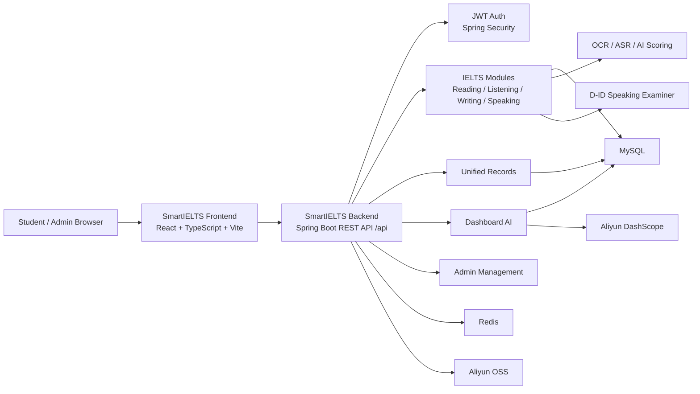
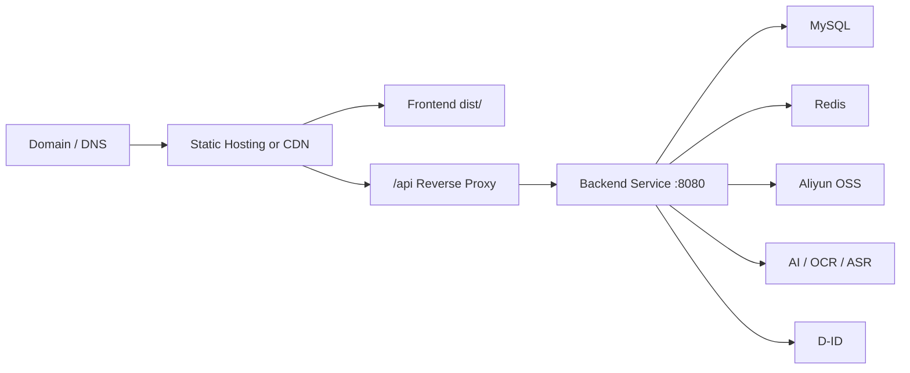

<p align="right">
  <a href="./README.md"></a>
  <a href="./README.zh-TW.md"></a>
</p>

<h1 align="center">SmartIELTS</h1>

<p align="center">
  <strong>AI-assisted IELTS learning platform hub</strong><br>
  Overview, architecture, startup guide, deployment flow, repository links, demo entry points, and API contract navigation.
</p>

<p align="center">
  <strong>Main Repository</strong> · <strong>Docs Only</strong> · <strong>Frontend + Backend Split</strong>
</p>

---

## Repository Role

**`SmartIELTS` is the main project hub. It does not store application source code.**

This repository is responsible for:

- Product overview and system architecture.
- Frontend and backend repository links.
- Local startup instructions for the full stack.
- Deployment flow and environment requirements.
- Demo screenshot placeholders and capture checklist.
- API contract entry point.
- Contributor orientation for the split repositories.

Application code lives in the dedicated repositories:

| Repository | Role | Contents |
| --- | --- | --- |
| **[SmartIELTS-frontend](https://github.com/Andrew-Ng701/SmartIELTS-frontend)** | Frontend application | React, TypeScript, Vite, Tailwind CSS, frontend README, deployment guide, `.env.example` |
| **[SmartIELTS-backend](https://github.com/Andrew-Ng701/SmartIELTS-backend)** | Backend service | Spring Boot, Java, MyBatis, MySQL, Redis, API docs, DB migrations, backend deployment guide |
| **[SmartIELTS](https://github.com/Andrew-Ng701/SmartIELTS)** | Main hub | This overview README, architecture diagram, startup and deployment guide, links, screenshots, API contract entry |

---

## Product Overview

SmartIELTS is an IELTS preparation system covering **Reading, Listening, Writing, and Speaking**. It provides student practice workflows, score records, profile targets, admin content management, dashboard summaries, and AI-assisted feedback.

Key capabilities:

- **Student workspace**: module practice, answer submission, records, review pages, profile, and target bands.
- **Admin workspace**: users, records, exam content authoring, deleted item management, and operational console.
- **AI support**: dashboard ask flow, writing/speaking scoring support, learning context, and executive summaries.
- **Media support**: profile images, question group images, listening audio, speaking audio, and D-ID speaking examiner integration.
- **API-first split**: frontend consumes typed REST APIs; backend owns business rules, scoring, persistence, permissions, and status transitions.

---

## Architecture



Responsibility boundary:

| Layer | Owns |
| --- | --- |
| Frontend | UI rendering, input collection, local interaction state, upload UX, API request orchestration, response mapping |
| Backend | Authentication, authorization, validation, persistence, scoring, server-owned IDs/timestamps, status transitions, transaction consistency |
| Database | MySQL schema, records, module content, users, business resources |
| External services | Object storage, AI scoring, OCR/ASR, D-ID speaking avatar |

---

## Local Full-Stack Startup

### 1. Backend

Clone and enter the backend repository:

```powershell
git clone https://github.com/Andrew-Ng701/SmartIELTS-backend.git
Set-Location SmartIELTS-backend
```

Prepare runtime services:

- JDK 17+
- MySQL 8+
- Redis 6+
- Database schema and migrations from `scripts/sql/`
- Backend environment variables from the backend README

Start the backend:

```powershell
.\mvnw.cmd spring-boot:run
```

Default API base URL:

```text
http://localhost:8080/api
```

### 2. Frontend

Clone and enter the frontend repository:

```powershell
git clone https://github.com/Andrew-Ng701/SmartIELTS-frontend.git
Set-Location SmartIELTS-frontend
```

Install dependencies and start Vite:

```powershell
npm install
Copy-Item .env.example .env
npm.cmd run dev
```

Default frontend URL:

```text
http://127.0.0.1:5173
```

The frontend calls `/api/...`; Vite proxies local requests to `http://localhost:8080`.

---

## Environment Requirements

| Area | Requirement |
| --- | --- |
| Frontend runtime | Node.js compatible with Vite 7, npm |
| Backend runtime | JDK 17+, Maven Wrapper |
| Database | MySQL 8+ |
| Cache/runtime store | Redis 6+ |
| Storage | Aliyun OSS for image/audio/file resources |
| AI | Aliyun DashScope, OCR/ASR where enabled |
| Speaking examiner | D-ID API and same-origin frontend iframe page |
| Production network | HTTPS, reverse proxy, CORS, secure environment variable injection |

---

## Deployment Flow

Recommended production topology:



Deployment checklist:

| Step | Frontend | Backend |
| --- | --- | --- |
| Build | `npm ci && npm run build` | `.\mvnw.cmd clean package` |
| Artifact | `dist/` | `target/SmartIELTS-0.0.1-SNAPSHOT.jar` |
| Runtime | Static host / CDN / Nginx | JVM service |
| Routing | SPA fallback to `index.html` | `/api/**` REST endpoints |
| Config | `VITE_API_BASE_URL`, D-ID frontend vars | DB, Redis, JWT, OSS, AI, D-ID vars |
| Security | No browser-exposed secrets | No committed secrets; HTTPS webhook for D-ID |

---

## API Contract Entry

The API contract is maintained in the backend repository:

- [Backend API contract](https://github.com/Andrew-Ng701/SmartIELTS-backend/blob/main/docs/api/api-contract.md)
- [Backend overview](https://github.com/Andrew-Ng701/SmartIELTS-backend/blob/main/docs/backend/backend-overview.md)
- [Database overview](https://github.com/Andrew-Ng701/SmartIELTS-backend/blob/main/docs/database-overview.md)

Core API base paths:

```text
/api/auth/**
/api/user/**
/api/admin/**
/api/smartielts/dashboard/**
```

Shared response envelope:

```ts
type Result<T> = {
  code: 0 | 1;
  msg: string | null;
  data: T;
};
```

Authenticated requests use:

```http
Authorization: Bearer <token>
```

---

## Demo Screenshots

Screenshots should be stored in this main repository when available. Suggested capture set:

| Screenshot | Purpose |
| --- | --- |
| Landing page | Public product entry |
| Student dashboard | Learning overview and module progress |
| Reading / Listening workspace | Exam-like practice flow |
| Writing / Speaking result | AI scoring and review surface |
| User records | Cross-module history and detail entry |
| Admin console | Operational overview |
| Admin authoring | Content management workflow |
| AI Agent drawer | Dashboard ask and explanation flow |

Recommended future path:

```text
docs/screenshots/
```

---

## Repository Maintenance Rules

- Keep application source code out of this main repository.
- Put frontend code and frontend docs in `SmartIELTS-frontend`.
- Put backend code, API docs, DB migrations, and backend docs in `SmartIELTS-backend`.
- Keep this README aligned with repository links, startup commands, deployment flow, screenshots, and API contract entry points.
- Do not commit production secrets, `.env` files, access keys, tokens, or database dumps.

---

## Quick Links

| Resource | Link |
| --- | --- |
| Main hub | [SmartIELTS](https://github.com/Andrew-Ng701/SmartIELTS) |
| Frontend code | [SmartIELTS-frontend](https://github.com/Andrew-Ng701/SmartIELTS-frontend) |
| Backend code | [SmartIELTS-backend](https://github.com/Andrew-Ng701/SmartIELTS-backend) |
| API contract | [docs/api/api-contract.md](https://github.com/Andrew-Ng701/SmartIELTS-backend/blob/main/docs/api/api-contract.md) |
| Frontend README | [SmartIELTS-frontend README](https://github.com/Andrew-Ng701/SmartIELTS-frontend/blob/main/README.md) |
| Backend README | [SmartIELTS-backend README](https://github.com/Andrew-Ng701/SmartIELTS-backend/blob/main/README.md) |
