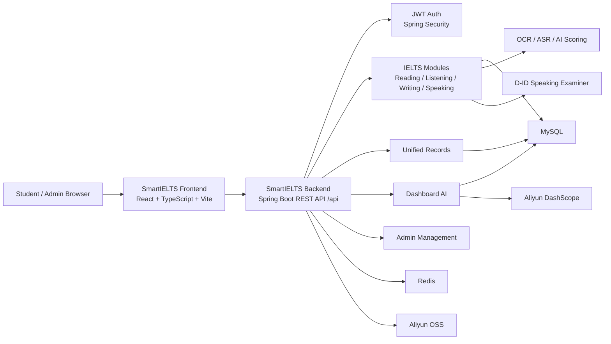
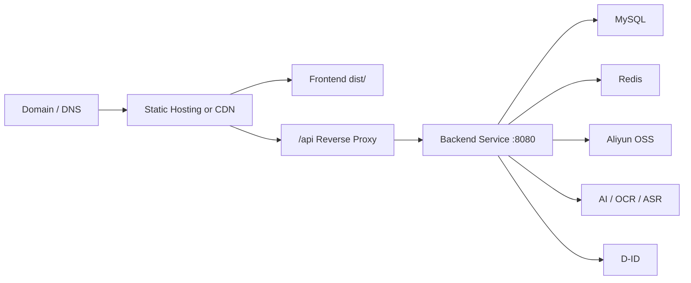

<p align="right">
  <a href="./README.md"></a>
  <a href="./README.zh-TW.md"></a>
</p>

<h1 align="center">SmartIELTS</h1>

<p align="center">
  <strong>AI 輔助 IELTS 學習平台主倉庫</strong><br>
  放置總覽、架構、啟動方式、部署流程、repo links、demo screenshots 與 API contract 入口。
</p>

<p align="center">
  <strong>主倉庫</strong> · <strong>只放文件</strong> · <strong>前後端分倉</strong>
</p>

---

## 倉庫定位

**`SmartIELTS` 是主倉庫，只作為專案入口，不放前端或後端實際代碼。**

本倉庫負責：

- 專案總覽與系統架構。
- 前端與後端倉庫連結。
- 本地完整啟動方式。
- 部署流程與環境需求。
- Demo screenshots 的放置入口與截圖清單。
- API contract 入口。
- 前後端分倉後的協作說明。

實際代碼放在以下倉庫：

| Repository | 定位 | 內容 |
| --- | --- | --- |
| **[SmartIELTS-frontend](https://github.com/Andrew-Ng701/SmartIELTS-frontend)** | 前端應用 | React、TypeScript、Vite、Tailwind CSS、前端 README、部署說明、`.env.example` |
| **[SmartIELTS-backend](https://github.com/Andrew-Ng701/SmartIELTS-backend)** | 後端服務 | Spring Boot、Java、MyBatis、MySQL、Redis、API 文件、DB migration、後端部署說明 |
| **[SmartIELTS](https://github.com/Andrew-Ng701/SmartIELTS)** | 主倉庫 | 總覽 README、架構圖、啟動與部署指南、倉庫連結、screenshots、API contract 入口 |

---

## 產品總覽

SmartIELTS 是一個覆蓋 **Reading、Listening、Writing、Speaking** 的 IELTS 學習與練習系統。系統提供學生練習流程、分數紀錄、個人目標、後台內容管理、dashboard summary 與 AI 輔助回饋。

核心能力：

- **學生端**：模組練習、答題提交、紀錄、詳情 review、profile 與目標分數。
- **管理端**：使用者、紀錄、試題內容、刪除項目與營運 console。
- **AI 支援**：dashboard ask、Writing/Speaking scoring、learning context、executive summary。
- **媒體支援**：profile image、question group image、listening audio、speaking audio、D-ID speaking examiner。
- **API-first 分層**：前端消費 typed REST API；後端負責業務規則、評分、持久化、權限與狀態轉換。

---

## 系統架構



責任邊界：

| Layer | 負責內容 |
| --- | --- |
| Frontend | UI render、輸入收集、本地互動狀態、upload UX、API request orchestration、response mapping |
| Backend | 登入驗證、權限、validation、persistence、scoring、server-owned IDs/timestamps、status transition、transaction consistency |
| Database | MySQL schema、records、module content、users、business resources |
| External services | Object storage、AI scoring、OCR/ASR、D-ID speaking avatar |

---

## 本地完整啟動

### 1. 後端

Clone 後端倉庫：

```powershell
git clone https://github.com/Andrew-Ng701/SmartIELTS-backend.git
Set-Location SmartIELTS-backend
```

準備 runtime：

- JDK 17+
- MySQL 8+
- Redis 6+
- `scripts/sql/` 內的 DB schema 與 migration
- 後端 README 中列出的環境變數

啟動後端：

```powershell
.\mvnw.cmd spring-boot:run
```

預設 API base URL：

```text
http://localhost:8080/api
```

### 2. 前端

Clone 前端倉庫：

```powershell
git clone https://github.com/Andrew-Ng701/SmartIELTS-frontend.git
Set-Location SmartIELTS-frontend
```

安裝依賴並啟動 Vite：

```powershell
npm install
Copy-Item .env.example .env
npm.cmd run dev
```

預設前端 URL：

```text
http://127.0.0.1:5173
```

前端呼叫 `/api/...`，本地由 Vite proxy 到 `http://localhost:8080`。

---

## 環境需求

| 類別 | 需求 |
| --- | --- |
| Frontend runtime | Node.js compatible with Vite 7、npm |
| Backend runtime | JDK 17+、Maven Wrapper |
| Database | MySQL 8+ |
| Cache/runtime store | Redis 6+ |
| Storage | Aliyun OSS |
| AI | Aliyun DashScope、OCR/ASR |
| Speaking examiner | D-ID API 與 same-origin frontend iframe page |
| Production network | HTTPS、reverse proxy、CORS、安全注入環境變數 |

---

## 部署流程



部署檢查：

| Step | Frontend | Backend |
| --- | --- | --- |
| Build | `npm ci && npm run build` | `.\mvnw.cmd clean package` |
| Artifact | `dist/` | `target/SmartIELTS-0.0.1-SNAPSHOT.jar` |
| Runtime | Static host / CDN / Nginx | JVM service |
| Routing | SPA fallback 到 `index.html` | `/api/**` REST endpoints |
| Config | `VITE_API_BASE_URL`、D-ID frontend vars | DB、Redis、JWT、OSS、AI、D-ID vars |
| Security | 不放 browser-exposed secrets | 不提交 secrets；D-ID webhook 使用 HTTPS |

---

## API Contract 入口

API contract 維護在後端倉庫：

- [Backend API contract](https://github.com/Andrew-Ng701/SmartIELTS-backend/blob/main/docs/api/api-contract.md)
- [Backend overview](https://github.com/Andrew-Ng701/SmartIELTS-backend/blob/main/docs/backend/backend-overview.md)
- [Database overview](https://github.com/Andrew-Ng701/SmartIELTS-backend/blob/main/docs/database-overview.md)

核心 API base path：

```text
/api/auth/**
/api/user/**
/api/admin/**
/api/smartielts/dashboard/**
```

共用 response envelope：

```ts
type Result<T> = {
  code: 0 | 1;
  msg: string | null;
  data: T;
};
```

登入後使用：

```http
Authorization: Bearer <token>
```

---

## Demo Screenshots

有 screenshots 後建議放在本主倉庫：

```text
docs/screenshots/
```

建議截圖清單：

| Screenshot | 用途 |
| --- | --- |
| Landing page | 專案入口 |
| Student dashboard | 學習總覽與進度 |
| Reading / Listening workspace | 考試式練習流程 |
| Writing / Speaking result | AI scoring 與 review |
| User records | 跨模組紀錄 |
| Admin console | 管理總覽 |
| Admin authoring | 內容管理流程 |
| AI Agent drawer | Dashboard ask flow |

---

## 維護規則

- 本主倉庫不放前端或後端實際代碼。
- 前端代碼與前端文件放在 `SmartIELTS-frontend`。
- 後端代碼、API docs、DB migrations 與後端文件放在 `SmartIELTS-backend`。
- 本 README 要維持倉庫連結、啟動指令、部署流程、screenshots 與 API contract 入口的準確性。
- 不提交 production secrets、`.env`、access key、token 或 database dump。

---

## 快速連結

| Resource | Link |
| --- | --- |
| Main hub | [SmartIELTS](https://github.com/Andrew-Ng701/SmartIELTS) |
| Frontend code | [SmartIELTS-frontend](https://github.com/Andrew-Ng701/SmartIELTS-frontend) |
| Backend code | [SmartIELTS-backend](https://github.com/Andrew-Ng701/SmartIELTS-backend) |
| API contract | [docs/api/api-contract.md](https://github.com/Andrew-Ng701/SmartIELTS-backend/blob/main/docs/api/api-contract.md) |
| Frontend README | [SmartIELTS-frontend README](https://github.com/Andrew-Ng701/SmartIELTS-frontend/blob/main/README.md) |
| Backend README | [SmartIELTS-backend README](https://github.com/Andrew-Ng701/SmartIELTS-backend/blob/main/README.md) |
